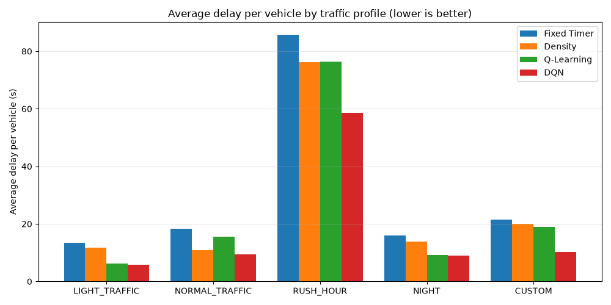
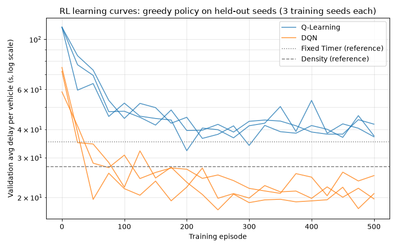

# IntelliFlow: Project Documentation

Technical reference for the simulator, the controllers, the reinforcement-learning
pipeline and the evaluation methodology. For a quick overview see [README.md](README.md).
Numeric results live in one place, [results/model_cards.md](results/model_cards.md),
which `run_experiments.py` regenerates. This document explains how they're produced.

1. Overview & design goals
2. Project structure
3. Core domain model
4. Traffic scenarios (the dataset)
5. Signal timing, scheduling and emergency preemption
6. Controllers (strategies)
7. Vehicle discharge (service model)
8. Metrics
9. Reinforcement-learning pipeline
10. Experiment methodology
11. Results summary
12. Testing
13. How to run
14. Reproducibility
15. Known limitations

---

## 1. Overview & Design Goals

Every simulation tick (0.5 s) the system:

1. **Spawns** vehicles from a seeded, time-dependent traffic profile.
2. **Schedules** signal phases. A generic `TrafficScheduler` asks a pluggable strategy
   which phase to run next; ambulance preemption always comes first.
3. **Discharges** vehicles on green lanes, at a rate that depends on vehicle type.
4. **Measures** delay, queues, throughput and more.

Design goals:

- **A generic scheduler** (Strategy pattern): Fixed Timer, Density and RL are
  interchangeable with no scheduler changes.
- **Safety outside learning**: ambulance handling is a rule-based state machine that
  the RL agent never sees or controls.
- **Determinism**: a seed reproduces identical arrivals, vehicle types and ambulances,
  which fair controller comparisons depend on.

---

## 2. Project Structure

```
traffic/
├── main.py                      # live console simulation
├── simulation.py                # Simulation: wires everything, runs the tick loop
├── run_experiments.py           # controlled experiment -> results/, images/, models/
├── plot_rewards.py              # quick tabular-Q training-reward plot
├── pytest.ini, tests/           # test suite (CI: .github/workflows/tests.yml)
│
├── core/                        # domain model
│   ├── enums.py                 # PhaseType, MovementType, VehicleType, Priority, SignalState
│   ├── vehicle.py, queue.py, lane.py, signal.py
│   ├── movement.py              # approach + movement type + lane + signal (16 total)
│   ├── approach.py              # 4 lanes / movements per approach
│   ├── phase.py                 # a set of movements that are green together
│   └── intersection.py          # 4 approaches; spawning and aggregate state
├── config/
│   ├── phases.py                # the official 10-phase plan + emergency phase builder
│   ├── simulation.py            # tick, green/yellow, emergency timing, service times
│   ├── traffic_profiles.py      # the 5 scenarios
│   ├── density.py               # Density controller parameters
│   ├── perception.py            # long-wait threshold, simulated camera-error rates
│   └── rl.py                    # RL environment, agents, training, validation
├── scheduler/traffic_scheduler.py
├── strategies/                  # base_strategy, fixed_timer, density, rl_strategy
│                                # (+ queue_relaxation / emergency placeholders)
├── traffic_source/              # profile_traffic_source (used), random, yolo/sumo placeholders
├── services/service_model.py
├── analytics/                   # statistics.py (KPIs), logger.py (per-tick CSV)
├── perception/                  # observation.py (per-lane contract), simulated.py (exact / noisy)
├── env/                         # traffic_env.py (Gym-style env), state_builder.py
├── rl/                          # agents.py (tabular Q), dqn.py (numpy DQN), train.py
├── evaluation/evaluate.py       # quick side-by-side strategy comparison
├── results/                     # results_table.csv, model_cards.md (generated)
├── images/                      # G1–G4 charts (generated)
└── models/                      # trained agents + training history (generated, gitignored)
```

---

## 3. Core Domain Model

| Class | Responsibility |
|---|---|
| `Vehicle` | Type, priority (ambulance = HIGH), accumulated waiting time |
| `Queue` | FIFO of vehicles; running total of their waiting time |
| `Lane` | Owns a `Queue`; one lane per movement |
| `Signal` | RED / YELLOW / GREEN |
| `Movement` | Approach + movement type + lane + signal. 16 in total: North/South/East/West × Left/Straight/Right/U-turn |
| `Approach` | The 4 movements of one direction |
| `Phase` | A set of movements that are green together |
| `Intersection` | The 4 approaches; spawning, waiting-time updates, the clock |

**Traffic convention:** left-hand traffic. Left turns are the "free" movements and
appear in most phases.

### The 10-phase plan

Defined in `config/phases.py` from the official phase diagrams. Each phase holds 7–8 of
the 16 movements, and **every phase serves at least one movement on every approach**.
The scheduler only ever activates these 10 phases, plus `EMERGENCY_OVERRIDE`, which is
built at runtime and greens all 4 movements of the ambulance's approach. The plan is
pinned movement for movement by `tests/test_phase_plan.py`.

---

## 4. Traffic Scenarios (the Dataset)

Synthetic, generated by the seeded simulator; there is no external dataset. Each profile is a
schedule of time windows; each window sets an arrival rate (vehicles/s) for every one of the 16
movements, plus a vehicle mix.

| Profile | Description |
|---|---|
| `LIGHT_TRAFFIC` | Low, balanced volume |
| `NORMAL_TRAFFIC` | Average daytime flow, mild asymmetry |
| `RUSH_HOUR` | Heavy, asymmetric commuting |
| `NIGHT` | Very low volume, truck-heavy |
| `CUSTOM` | Time-varying: morning → rush → normal → evening |

Vehicle mix (default): car 70%, bike 18%, bus 6%, truck 5%, ambulance 1%.

**RUSH_HOUR is over capacity.** Demand is about 3.3 veh/s against about 2.7 veh/s of
service capacity, so queues grow under every controller, even with ambulances
disabled. With 1% ambulances, one arrives roughly every 30 s, and a large share of that
profile is spent in emergency preemption. It is kept deliberately as a stress test, and
results are reported per profile so it can't dominate the averages.

---

## 5. Signal Timing, Scheduling and Emergency Preemption

`TrafficScheduler.update()` runs once per tick:

1. **An emergency in progress** advances the emergency state machine (below) and stops there.
2. **A new ambulance** queued on any approach (scanned North, South, East, West) starts preemption.
3. **Otherwise, normal scheduling**: count down green; when it runs out, call
   `strategy.on_green_end()` (extend, end, or hold). On ending: 2 s yellow, then
   `strategy.decide_next_phase()` picks the next phase and its green time.

`on_green_end()` returns `None` by default (no extension), so Fixed Timer and Density
size their green up front. The RL strategy uses it to extend green in 5 s steps.

### Emergency preemption

```
NORMAL GREEN → 2 s YELLOW CLEARANCE → EMERGENCY GREEN (ambulance's approach only)
            → held until the ambulance has cleared → RESUME NORMAL SCHEDULING
```

- **Fail-safe:** the emergency green is released after 30 s even if the ambulance
  hasn't cleared (for example, when it's stuck behind a long queue).
- **Cooldown:** after a fail-safe release, that approach can't preempt again for 30 s,
  so normal service really resumes. Without it, the still-queued ambulance was
  re-detected on the next tick and the intersection never left emergency mode. Other
  approaches can still preempt during the cooldown.

Timings live in `config/simulation.py` (`EMERGENCY_YELLOW_TIME`, `EMERGENCY_MAX_TIMEOUT`,
`EMERGENCY_COOLDOWN`).

---

## 6. Controllers (Strategies)

All implement `BaseStrategy` and plug into `Simulation(strategy_key=...)` or `Simulation(strategy=...)`.

### 6.1 Fixed Timer (baseline)
Round-robin through PHASE_1 → PHASE_10 with a fixed 12 s green.

### 6.2 Density (rule-based adaptive)
Observes only the number of queued vehicles per approach. At each decision:

1. **Rank** the 4 approaches by queue length (ties: North, South, East, West).
2. **Classify** by rank ("quartile" mode: HIGH, MEDIUM, MEDIUM, LOW), with weights 3 / 2 / 1.
3. **Score all 10 phases**: Σ over approaches of (weight × fraction of that approach's 4
   movements the phase serves). The highest score wins; ties go to the lower phase number.
4. **Phase-recency bonus**: a phase not chosen for 6+ decisions gets +3 per decision
   waited. This keeps phases that are subsets of others (e.g. PHASE_1 ⊂ PHASE_8)
   reachable.
5. **Green time**: if the longest approach queue is ≥ 15 vehicles, green is extended
   from 10 s in 5 s steps toward (longest queue ÷ 2 veh/s), capped at 40 s; otherwise 10 s.

How it behaves in practice (5 profiles × 10 min, 214 decisions):

- The **phase-recency bonus is active in 86% of decisions**, so it shapes most choices.
- **Green is the 10 s minimum in 89% of decisions**.
- The **approach-level starvation boost never fires.** It triggers when an approach
  goes unserved for 4 decisions, but every phase serves every approach (§3), so that
  can't happen. The phase-recency bonus is what actually provides fairness.

Parameters: `config/density.py`.

### 6.3 RLStrategy (learned)
Wraps a trained agent (tabular Q or DQN) and acts greedily: `argmax_a Q(state, a)`.
It uses extend-or-switch control (§9.2). No learning happens during evaluation.

---

## 7. Vehicle Discharge (Service Model)

Each green lane accumulates green time; the vehicle at the head of the queue leaves once
the accumulated time covers its service time, and the remainder carries over.

| Vehicle | Service time (s) |
|---|---|
| Bike | 0.6 |
| Car | 1.0 |
| Bus | 1.8 |
| Truck | 2.2 |
| Ambulance | 0.8 |

Yellow and red lanes don't discharge. The scheduler knows nothing about service rates.

---

## 8. Metrics

Primary metric: **delay per vehicle**, the seconds a vehicle spends queued.

| Metric | Definition |
|---|---|
| Avg / P95 / Max delay | Over every vehicle in the run. Vehicles still queued at the end count with the delay accrued so far, so leaving vehicles unserved never looks good |
| Ambulance delay | The same, for ambulances only |
| Avg queue | Total vehicles queued at the intersection, averaged over ticks |
| Max lane queue | Longest single lane seen |
| Throughput | Vehicles served per simulated second |
| Congestion ratio | Fraction of ticks with ≥ 10 vehicles queued in total |
| Queued veh-s | Legacy "average waiting time": the total waiting time of everyone queued, averaged over ticks. Vehicle-seconds, **not** seconds per vehicle |

Implemented in `analytics/statistics.py`.

---

## 9. Reinforcement-Learning Pipeline

### 9.1 Environment (`env/traffic_env.py`)

```
reset()        -> 75-dim observation at the first decision point
step(action)   -> (next_obs, reward, done, info)      action in 0..9
info           -> {"duration": seconds the step lasted, "truncated": bool}
```

The env drives the same scheduler, discharge and spawning code as `Simulation`. A
**decision point** is the moment the scheduler asks the strategy for a decision. The env
pauses mid-tick at that moment, hands the observation to the agent, and resumes the same
tick with the chosen action, so no simulated time is spent waiting, and the reward
returned by `step(a)` covers exactly the time `a` was in control.

**Observation** (built by one function for both training and inference, so the two can't
differ). The agent never reads the simulator directly: it receives a **perception**
summary (§9.6) and turns it into 75 numbers:

| Index | Feature |
|---|---|
| 0–63 | For each of the 16 lanes: count ÷ 10, mean wait ÷ 60 s, longest wait ÷ 60 s (waits capped at 3), number of vehicles waiting > 60 s ÷ 10 |
| 64–73 | Active phase, one-hot |
| 74 | Elapsed green of the active phase ÷ 40 s |

The long-waiter count makes "1 vehicle waiting 150 s" and "10 vehicles waiting 150 s"
different states, and lane resolution matches what a phase actually serves.

**Reward:** each queued vehicle costs, per second, `1 + max(0, wait − 60 s) / 30 s`: 1/s up
to a 60 s wait, then 3/s at 120 s and 5/s at 180 s. The step's reward is −(total cost) ÷ 100.
Because the cost is summed over vehicles, ten long-waiting vehicles cost ten times one,
and a long-waiting group gradually outweighs a larger group of fresh arrivals (§9.7).

**Episodes:** 1,200 ticks (10 min). The end of an episode is a **truncation**, not a
terminal state, so learners still bootstrap from the final state.

### 9.2 Actions: extend-or-switch
Each time the active green runs out, the agent picks one of the 10 phases:

- **Same phase** → extend green by 5 s.
- **Another phase** → 2 s yellow, then that phase with a 10 s minimum green.
- **At the 40 s cap**, "extend" advances to the next phase in order (the agent can see elapsed green).

These are the same 10 / +5 / 40 s bounds Density uses. Steps therefore last 5 s or 12 s
(longer if an ambulance interrupts), so discounting is **per second**: γ = 0.9925^seconds
(≈ 0.9 for a 14 s step).

### 9.3 Agents
- **Tabular Q-learning** (`rl/agents.py`): state = queue LOW/MED/HIGH per approach
  (< 5, 5–19, ≥ 20) × active phase × elapsed-green level (< 15 s, 15–35 s, cap) =
  **2,430 states**; Q-table (2430, 10).
- **DQN** (`rl/dqn.py`), all numpy: MLP 75 → 64 → 64 → 10 (ReLU), Adam optimiser,
  experience replay (20k), target network (synced every 200 updates), **Double-DQN**
  targets, **Huber loss**, gradient-norm clipping (10). The backprop is checked
  against finite differences in the tests.

### 9.4 Training (`rl/train.py`)
- 500 episodes per agent; the profile rotates every episode, and each episode has its own seed.
- Epsilon decays linearly from 1.0 to 0.05 over the first 70% of episodes, then stays at 0.05.
- Every 25 episodes the **greedy** policy is scored on held-out validation seeds, using
  the same protocol as the final evaluation. The **best checkpoint** is kept.
- `run_experiments.py` trains each agent from 3 seeds (42, 7, 123) in parallel.

### 9.5 Reward scale and the Huber loss
The Huber loss switches from quadratic to linear at a fixed TD error (δ = 1). With rewards
divided by 1000, light-traffic TD errors (~0.01) were negligible next to rush-hour errors
(capped at δ), so the DQN effectively ignored light traffic: its Q-values there were
~100× smaller than in rush hour, and the gap between its best and second-best action
(~0.02) was below the network's fitting error. Dividing by 100 lifts light-traffic errors to
~0.1 while rush-hour gradients stay capped, rebalancing what the network learns from.

Chosen on the validation seeds (5 variants tried, test set untouched until the final run):

| Variant (validation avg delay, s) | Light | Normal | Rush | Night | Custom | Mean |
|---|---|---|---|---|---|---|
| ÷1000 (previous) | 20.1 | 11.0 | 63.4 | 18.4 | 12.2 | 25.0 |
| ÷1000 + value rescaling | 17.6 | 11.1 | 67.8 | 21.3 | 11.0 | 25.8 |
| ÷100 + value rescaling | 13.6 | 10.1 | 56.5 | 16.4 | 10.6 | 21.4 |
| **÷100** (chosen) | 10.9 | 10.0 | 50.5 | 11.3 | 10.9 | 18.7 |
| ÷10 | 10.8 | 10.7 | 46.9 | 11.4 | 11.3 | 18.2 |

÷10 is within seed noise of ÷100; ÷100 was kept as the smaller change. Value rescaling
(h(Q) = sign(Q)(√(|Q|+1) − 1) + εQ, as in R2D2) is implemented and tested but off
(`DQN_VALUE_RESCALING`), since it didn't help here.

### 9.6 Perception: what the controller sees (`perception/`)
`IntersectionObservation` holds, for each lane, the wait of every visible queued vehicle.
That's what a camera can measure: detection gives the vehicles in each lane region, and
tracking gives how long each has been stopped. Two sources exist today:

- `GroundTruthPerception`: exact queues from the simulator (used for training).
- `NoisyPerception`: simulated camera errors. 5% missed vehicles, a 2% chance of a
  phantom detection per lane, only the first 15 vehicles of each lane visible, ±10%
  wait-estimate error, 5% lost-and-re-acquired tracks (wait underestimated). These rates
  are **assumptions** in `config/perception.py`, to be calibrated on real footage.

A future camera pipeline implements the same `observe()` contract; the controller doesn't change.
The reward still uses true waits, because it's only needed in training, in simulation.

### 9.7 Fairness: weighing how many vehicles wait, and for how long
With a plain total-delay reward, one vehicle waiting 180 s costs the same as 36 vehicles
waiting 5 s each, so the agent occasionally left a lone vehicle waiting minutes on a quiet
junction (longest night wait 165 s vs Density's 78 s). The wait-aware reward and the
long-waiter features fix that. Chosen on validation seeds with a selection rule written
down before any variant was run (slopes 60 / 30 / 15 s and a features-only variant
compared; slope 30 s chosen). On the test seeds, the longest night wait fell to 77 s.

### 9.8 Safety envelope (deployment only)
The learned policy runs inside three rules, like the safety logic around any real adaptive
controller. They are applied only when the controller is deployed; the training env turns
them off, so the agent is only ever credited for its own actions.

| Rule | What it does |
|---|---|
| No empty green | If the agent picks a phase that serves no visible vehicle while vehicles wait elsewhere, the phase with the most accumulated waiting (sum of the waits of the vehicles it would serve) is used instead |
| Maximum red, 90 s | A lane with vehicles that has been red for 90 s is served next (the phase covering the most such vehicles) |
| Camera-failure fallback | If perception reports the sensor down (`available=False`), phases rotate in fixed order until it recovers |

They were chosen on the edge-case stress test (§10.1) with a rule written down in advance. The
raw policy, for comparison: a lone car at an empty junction waited 332 s; with the envelope,
14 s. The envelope also improves the standard benchmark (average delay 18.7 → 18.5 s,
longest wait 130 → 105 s, light traffic 13.2 → 5.7 s), at a small cost in throughput.

---

## 10. Experiment Methodology

`run_experiments.py`:

- **4 controllers**: Fixed Timer, Density, Q-Learning, DQN.
- **Identical conditions**: 5 profiles × 5 test seeds × 1,200 ticks (10 min). Only the
  strategy differs.
- **Disjoint seeds**: training 42+ / 7+ / 123+, validation 1000–1001, test 1–5.
- **RL uncertainty**: each RL agent is evaluated once per training seed; tables show the
  mean ± std across training seeds.
- **Aggregation**: pooled means, a per-profile table, and a profile-balanced headline
  (mean over profiles of the % delay reduction vs Fixed Timer), so the oversaturated
  RUSH_HOUR can't dominate.
- **Significance**: paired bootstrap 95% CI of DQN − Density average delay over the 25
  (profile, seed) pairs.

Outputs: `results/results_table.csv` (one row per run), `results/model_cards.md`,
`images/G1–G4`, `models/` (per-seed agents + `training_history.json`). A full run takes
about 3 min on 12 cores; `--use-saved` re-evaluates in about 10 s and reproduces the outputs exactly.

### 10.1 Edge-case stress test (`evaluation/stress_test.py`)
Twelve hand-built scenarios (`ScenarioTrafficSource` combines random arrivals with
scripted events): empty junction, one car per lane at night, a flooded lane, main road vs
side road, 400 cars at once, a surge, all trucks, simultaneous ambulances on all
approaches, an ambulance behind a 30-car queue, an ambulance every 20 s, demand 30% above
capacity, a camera outage. Every controller runs every scenario (the DQN once per training
seed; the report shows the worst seed). An `InvariantMonitor` checks on every tick:

- **I1** only the active phase's movements are green; nothing green during yellow
- **I2** no switch away from a green phase without yellow
- **I3** every normal green lasts 10–40 s (unless an ambulance preempts it)
- **I4** spawned = served + queued
- **I5** every ambulance that arrived at least 60 s before the end was served

Result: 0 violations for every controller. A test plants a wrong green and checks that the
monitor catches it. Report: `results/stress_test.md`.

### 10.2 Simulation viewer (`visualize.py`, `viewer/template.html`)
Records Fixed Timer, Density and the deployed DQN on all 17 scenarios (one frame per
simulated second, from the real simulator) and writes a self-contained HTML replay:
synchronised junction views, live stats, a queue chart and an end-of-run table.

---

## 11. Results Summary

Current numbers: [results/model_cards.md](results/model_cards.md). What they show:

- **The deployed DQN is the best controller overall**: about 30% less average delay than
  Density (−8.0 s, 95% CI [−10.5, −5.8]), a shorter worst-case wait (105 vs 142 s), a better
  95th-percentile wait, shorter queues and lower ambulance delay. It wins in all five
  standard profiles.
- **Edge cases**: lowest average delay in 11 of 12; worst-case wait above both baselines in
  three (simultaneous ambulances, demand beyond capacity, camera outage). Safety invariants:
  0 violations.
- **Robust to camera errors**: with simulated detection and tracking errors, average delay
  rises about 2% (18.5 → 18.8 s).
- **The fairness trade-off is explicit**: the wait-aware reward and the safety envelope
  shorten the longest waits at a small cost in throughput.
- **Tabular Q-learning is behind Fixed Timer.** Its coarse LOW/MED/HIGH state can't tell
  "busy" from "gridlocked", which is the motivation for the DQN. It is also sensitive to
  tiny perturbations: a 1e-16 rounding difference flipping one tied `argmax` late in
  training is enough to send a run down a different path.




---

## 12. Testing

`python -m pytest` runs 88 tests (~40 s), also in CI on every push and pull request.

| Area | Examples |
|---|---|
| Phase plan | Pinned to the official diagrams; all 16 movements served; emergency phase = one approach |
| Scheduler | 12 s green → 2 s yellow → next; rotation; extension and hold hooks |
| Emergency | Clearance → emergency green → resume; fail-safe + cooldown |
| Discharge & metrics | Per-type service times; KPI definitions; delay including queued vehicles |
| RL environment | Reward credited to the right action; training/inference features identical; durations; truncation |
| Perception & fairness | Exact and noisy perception; per-lane features tell 1 long-waiter from 10; wait-aware reward maths |
| Safety envelope & edge cases | Max-red override; no empty green; camera-failure fallback; envelope off in training; invariant monitor catches a planted wrong green; rule-based controllers hold all invariants; deployed DQN serves lone cars in < 60 s |
| Learning code | Q-update maths; finite-difference gradient check; Adam; DQN learns a bandit |
| Regression | Exact golden KPIs for Fixed Timer and Density; end-to-end harness in quick mode |

---

## 13. How to Run

```bash
pip install -r requirements.txt
python main.py                          # live console simulation
python run_experiments.py               # full experiment (~3 min)
python run_experiments.py --use-saved   # re-evaluate saved models (~10 s)
python visualize.py                     # simulation viewer (opens in the browser)
python -m evaluation.stress_test        # edge cases + safety invariants
python plot_rewards.py [n_episodes]     # quick tabular-Q training run + reward plot
python -m pytest                        # tests
```

Environment variables for `run_experiments.py`: `EXPERIMENTS_OUT=<dir>` redirects all
outputs; `EXPERIMENTS_QUICK=1` runs a tiny configuration in seconds (used by the tests).

Side-by-side comparison of rule-based strategies:

```python
from evaluation.evaluate import evaluate_strategies, print_comparison
from strategies.fixed_timer_strategy import FixedTimerStrategy
from strategies.density_strategy import DensityStrategy

print_comparison(evaluate_strategies({"fixed_timer": FixedTimerStrategy(),
                                      "density": DensityStrategy()}))
```

---

## 14. Reproducibility

- Every random source is seeded; the same seed gives identical results, verified by
  repeated full runs producing byte-identical CSVs.
- Worker processes use a single BLAS thread (set before numpy loads) to avoid memory
  exhaustion and keep floating-point results stable.
- Trained models aren't committed (they're regenerated deterministically);
  `models/training_history.json` lets `--use-saved` rebuild the full report.
- Dependencies: numpy, matplotlib, pytest.

---

## 15. Known Limitations

- **Simulated cameras only**: the perception contract and the error model exist, but the
  camera pipeline (detection + tracking) and error rates measured on real footage don't yet.
- **Not provably optimal**: no controller can be. Safety properties are rule-enforced and
  checked; performance is measured on the standard benchmark and the edge cases.
- **Worst-case waits in three edge cases** (simultaneous ambulances on all approaches,
  demand beyond capacity, camera outage) are 4–46 s longer than the best baseline's.
- **RUSH_HOUR** is over capacity, with frequent ambulances (§4).
- **No conflict-matrix test**: the phase plan is pinned to the official diagrams, but
  movement compatibility isn't independently verified (no authoritative conflict table in the code).
- **Density's approach-level starvation boost is inert** with this phase plan (§6.2).
- **Placeholders**: queue-relaxation and emergency strategies, YOLO and SUMO traffic sources.
- **Single intersection**: no coordination between intersections.
